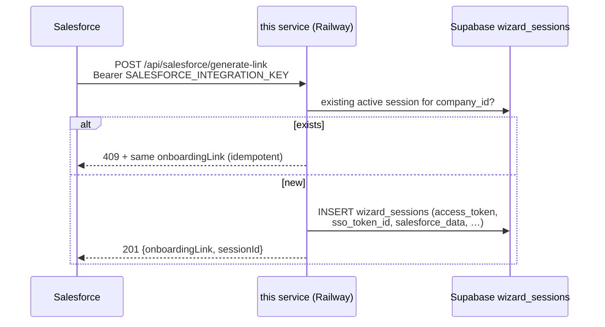

# fieldpulse-onboarding-api

Salesforce-facing API for the FieldPulse onboarding wizard. Stateless service backed by a shared Supabase project. Extracted from the `fieldpulse-onboarding` wizard repo so that the API can be deployed and versioned independently of the UI.

**Part of the FieldPulse onboarding system** — the system-level picture (all components,
diagrams, data model, environments) lives in the wizard repo:
[README](https://github.com/jaden-fp/fieldpulse-onboarding#readme) ·
[docs/architecture.md](https://github.com/jaden-fp/fieldpulse-onboarding/blob/master/docs/architecture.md).



## Endpoints

| Method | Path | Purpose |
|---|---|---|
| `POST` | `/api/salesforce/generate-link` | Called by Salesforce on Closed Won (or via manual SF action) to create a wizard session and return a pre-filled onboarding URL. Payload includes company details plus `founderUserSsoId` (→ `sso_token_id`, may be a hyphen-joined two-id value) and the custom-forms flag. |
| `POST` | `/api/auth/exchange` | **Legacy.** Proxies to the `exchange-token` Supabase Edge Function. The wizard app now performs its own exchange via its Next.js route — nothing in the live flow calls this. |

## Local development

```bash
npm install
cp .env.example .env.local
# fill in env vars
npm run dev
```

Server runs on `http://localhost:3000`.

## Environment variables

| Name | Required | Notes |
|---|---|---|
| `SALESFORCE_INTEGRATION_KEY` | yes | Bearer secret SF presents. Generate with `openssl rand -hex 32`. Different value per environment. |
| `NEXT_PUBLIC_SUPABASE_URL` | yes | Shared Supabase project URL. |
| `NEXT_PUBLIC_SUPABASE_ANON_KEY` | yes | Used by `/api/auth/exchange` to call the Edge Function. |
| `SUPABASE_SERVICE_ROLE_KEY` | yes | Used by `/api/salesforce/generate-link` to bypass RLS on insert. **Server-only — never expose.** |
| `NEXT_PUBLIC_APP_URL` | yes | Public URL of the wizard UI (production: `https://fieldpulse-onboarding.vercel.app`). Used to build the `onboardingLink` returned to SF. Must point to the wizard, NOT this API service. |

## Deployment (Railway)

This service is designed to run on Railway. Setup checklist:

1. **Create a new Railway project** pointed at this GitHub repo.
2. **Deploy from `main`** (or a `staging` branch for the staging env — one Railway project per env).
3. **Set the env vars above** in the Railway dashboard (use the Raw Editor for bulk edits). Note: there is **one shared Supabase project** (`rqelncbqgepyardwtltc`) across all environments — the Supabase values are the same everywhere; only `SALESFORCE_INTEGRATION_KEY` and `NEXT_PUBLIC_APP_URL` differ per environment.
4. **Generate `SALESFORCE_INTEGRATION_KEY`** with `openssl rand -hex 32`. Store the value in 1Password. Share with the Salesforce admin via a 1Password share link.
5. **Smoke-test after deploy:**

```bash
# 1. Should 401 — no auth header
curl -i https://<railway-url>/api/salesforce/generate-link

# 2. Should 401 — wrong key
curl -i -X POST https://<railway-url>/api/salesforce/generate-link \
  -H "Authorization: Bearer wrong-key" \
  -H "Content-Type: application/json" \
  -d '{}'

# 3. Should 400 — missing required fields
curl -i -X POST https://<railway-url>/api/salesforce/generate-link \
  -H "Authorization: Bearer $SALESFORCE_INTEGRATION_KEY" \
  -H "Content-Type: application/json" \
  -d '{}'

# 4. Should 201 — happy path
curl -i -X POST https://<railway-url>/api/salesforce/generate-link \
  -H "Authorization: Bearer $SALESFORCE_INTEGRATION_KEY" \
  -H "Content-Type: application/json" \
  -d '{
    "salesforceAccountId": "0011x00000TEST",
    "companyId": "FP-TEST-001",
    "companyName": "Acme Plumbing",
    "primaryContactEmail": "owner@acme.example",
    "numberOfEmployees": "11-20",
    "industry": "Construction",
    "currencyCode": "USD"
  }'

# 5. Re-run #4 — should 409 with the same link (idempotency check)
```

## Supabase prerequisites

This service writes to a `wizard_sessions` table created by a migration in the wizard repo (`fieldpulse-onboarding/supabase/migrations/001_create_wizard_sessions.sql`). Before deploying, verify the target Supabase project has:

- `wizard_sessions` table with the `salesforce_data` JSONB column and `wizard_status` enum
- RLS enabled and policies installed
- `exchange-token` Edge Function deployed (only required for `/api/auth/exchange` — not for SF-side testing of `/api/salesforce/generate-link`)

```bash
# From the wizard repo:
supabase functions list
supabase db push
```

## Notes on link expiration

Salesforce integration spec says onboarding links **do not expire**. The current `wizard_sessions` migration still has `expires_at NOT NULL DEFAULT now() + 14 days` from the original design. As a workaround, this service writes a sentinel far-future date (`2999-12-31`) on insert and ignores the column when looking up existing sessions. A follow-up migration to drop the `NOT NULL` constraint and remove the default is tracked separately.

## Code provenance

Initial code was extracted from commit `fc8cfe9` on the branch `feat/sf-link-generation-endpoint` in the wizard repo. The `transforms.ts` file is identical except that `companySizeOptions` (previously imported from the wizard's `general-info.schema.ts`) is inlined as a local constant, and `NZD` was added to `CURRENCY_MAP` to match the Salesforce field mapping spec.

## License

Private — FieldPulse internal.
